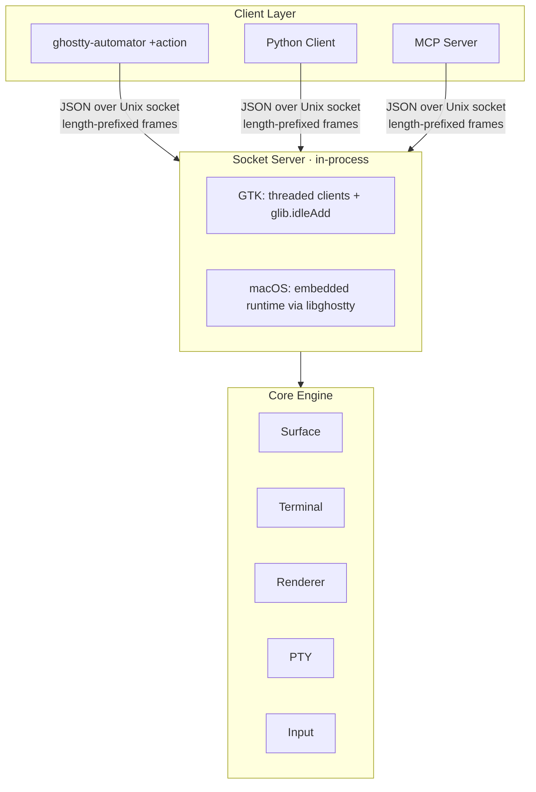

<h1 align="center">
  
  <br>
  Ghostty Automator
</h1>

<p align="center">
  <strong>Playwright for the terminal — programmatic control of Ghostty sessions over Unix sockets</strong>
</p>

<p align="center">
  <a href="https://github.com/hyperb1iss/ghostty-automator/actions/workflows/cicd.yml">
    
  </a>
  <a href="https://github.com/hyperb1iss/ghostty-automator/releases">
    
  </a>
  <a href="https://github.com/hyperb1iss/ghostty-automator/blob/automator/LICENSE">
    
  </a>
</p>

<p align="center">
  
  
  
  
</p>

<p align="center">
  <a href="#about">About</a> •
  <a href="#architecture">Architecture</a> •
  <a href="#building">Building</a> •
  <a href="#cli-actions">CLI Actions</a> •
  <a href="#protocol">Protocol</a> •
  <a href="#project-layout">Project Layout</a> •
  <a href="#roadmap">Roadmap</a>
</p>

---

## 🪄 About

Ghostty Automator is a fork of [Ghostty](https://ghostty.org) v1.3.1 that adds an IPC automation protocol for programmatic terminal control. Where browser automation has Playwright and Puppeteer, terminal automation has had nothing comparable — until now.

The automation protocol exposes 12 actions over Unix domain sockets using length-prefixed JSON frames. Clients can discover surfaces (windows, tabs, splits), read rendered screen content with full styling, inject keyboard/mouse/text input, capture screenshots, and manage windows — all through a single cross-platform transport.

This fork is designed for two primary audiences:

- **AI agents** that need to interact with terminal applications (Neovim, htop, TUI tools) through structured data rather than raw text streams
- **Test automation** for CLI and TUI applications that need to verify rendered output, not just stdout

### Companion Projects

| Project | Description |
|---------|-------------|
| [ghostty-automator-python](https://github.com/hyperb1iss/ghostty-automator-python) | Playwright-style Python client library with async support |
| [ghostty-terminal-automation skill](#claude-code-skill) | Claude Code skill for AI-driven terminal sessions |

## 🔮 Architecture



The socket server runs in-process alongside the terminal, dispatching automation requests directly to Ghostty's core engine. This gives the protocol access to the full terminal state — rendered cells with colors and attributes, cursor position, surface hierarchy, and GPU-accelerated screenshot capture.

**Transport:** `AF_UNIX` sockets with 4-byte little-endian length-prefixed JSON frames (max 16 MB).

**Socket paths:**
- Linux: `$XDG_RUNTIME_DIR/ghostty-automator/<instance>.sock`
- macOS: `$TMPDIR/ghostty-automator-$UID/<instance>.sock`

## ⚡ Building

### Prerequisites

- Zig 0.15.2
- Xcode 16.2 (macOS only, for app bundle + Metal renderer)

### Commands

```bash
# Debug build
zig build

# Optimized build
zig build -Doptimize=ReleaseFast

# Run directly
zig build run

# Skip macOS app bundle (faster iteration on macOS)
zig build -Demit-macos-app=false

# Run tests (prefer targeted runs — full suite is slow)
zig build test -Dtest-filter=<name>

# Format
zig fmt .
```

### Distribution

CI builds multi-platform artifacts on version tags (`v*`):
- `ghostty-automator` Linux x86_64 binary
- `Ghostty.app` macOS ARM64 bundle
- `skills/` directory for Claude Code integration

## 🎯 CLI Actions

All automation actions are built into the `ghostty-automator` binary as `+<action>` subcommands.

### Discovery

```bash
# Human-readable surface tree
ghostty-automator +list-surfaces

# JSON output for scripting
ghostty-automator +list-surfaces --format=json
```

Returns the full hierarchy: windows → tabs → surfaces, with IDs, titles, focus state, working directory, and grid dimensions.

### Screen Reading

```bash
# Read visible viewport as text
ghostty-automator +get-screen --surface=<id>

# JSON with cursor position
ghostty-automator +get-screen --surface=<id> --format=json

# Full scrollback
ghostty-automator +get-screen --surface=<id> --screen=screen

# Active screen only (no scrollback)
ghostty-automator +get-screen --surface=<id> --screen=active
```

On macOS, a **cells format** provides span-based encoding with full styling (foreground/background colors, bold, italic, underline, strikethrough, inverse) at roughly 450x compression versus per-cell JSON.

### Input Injection

```bash
# Send text (use \r for Enter)
ghostty-automator +send-text --surface=<id> --text="ls -la\r"

# Keyboard events (W3C UI Events key names)
ghostty-automator +send-key --surface=<id> --key=Enter
ghostty-automator +send-key --surface=<id> --key=KeyC --mods=ctrl
ghostty-automator +send-key --surface=<id> --key=ArrowUp

# Mouse (pixel coordinates)
ghostty-automator +send-mouse --surface=<id> --x=100 --y=200 --button=left --button-action=press

# Scroll
ghostty-automator +send-scroll --surface=<id> --y=3     # down
ghostty-automator +send-scroll --surface=<id> --y=-5    # up
```

**Key names:** `Enter`, `Tab`, `Escape`, `Backspace`, `Delete`, `Space`, `ArrowUp`/`Down`/`Left`/`Right`, `Home`, `End`, `PageUp`, `PageDown`, `F1`–`F12`, `KeyA`–`KeyZ`, `Digit0`–`Digit9`

**Modifiers:** `ctrl`, `shift`, `alt`, `super` (comma-separated)

### Window Management

```bash
ghostty-automator +new-window
ghostty-automator +new-tab
ghostty-automator +focus-surface --surface=<id>
ghostty-automator +close-surface --surface=<id>
ghostty-automator +resize-surface --surface=<id> --rows=40 --cols=120
```

### Screenshots

```bash
ghostty-automator +screenshot-surface --surface=<id> --output=/tmp/terminal.png
```

Uses GL readback (GTK) or native capture (macOS) for GPU-accelerated screenshots.

## 🌊 Protocol

The full protocol specification lives in [`docs/rfcs/terminal-automation-protocol.md`](docs/rfcs/terminal-automation-protocol.md).

### Request Format

```json
{
  "version": 1,
  "target": "0x153872000",
  "action": { "get_screen": { "format": "json" } }
}
```

### Response Format

```json
{
  "ok": true,
  "data": { "text": "...", "cursor": { "x": 0, "y": 23 } },
  "error": null
}
```

### Phase 1 Actions

| Action | Description |
|--------|-------------|
| `list_surfaces` | Discover windows, tabs, and surfaces |
| `get_screen` | Read terminal content (text, JSON, or cells) |
| `send_text` | Write raw text to PTY |
| `send_key` | Send keyboard events (W3C format) |
| `send_mouse` | Send mouse events at pixel coordinates |
| `send_scroll` | Send scroll deltas |
| `focus_surface` | Bring a window to the foreground |
| `close_surface` | Close a surface gracefully |
| `resize_surface` | Resize a window's terminal grid |
| `screenshot_surface` | Capture PNG via GPU readback |
| `new_window` | Create a new Ghostty window |
| `new_tab` | Create a new tab in the current window |

## 🧪 Claude Code Skill

The `skills/ghostty-terminal-automation/` directory ships a Claude Code skill that teaches AI agents the full automation workflow: bootstrapping a Ghostty instance, discovering surfaces, reading screen state, injecting input, and verifying results via screenshots.

This skill powers the `ghostty-terminal-automation` entry in Claude Code's skill registry and is bundled with release artifacts so it deploys alongside the binary.

## 🗺️ Project Layout

Automator-specific code lives alongside the upstream Ghostty source. Key locations:

### IPC Core

| Path | Purpose |
|------|---------|
| `src/apprt/ipc.zig` | Action definitions and dispatch |
| `src/apprt/socket.zig` | Unix socket protocol (JSON frames, request/response) |
| `src/apprt/ipc/mod.zig` | IPC module organization |
| `src/apprt/ipc/server.zig` | Generic socket server infrastructure |

### Platform Servers

| Path | Purpose |
|------|---------|
| `src/apprt/gtk/ipc.zig` | GTK IPC implementation |
| `src/apprt/gtk/ipc_server.zig` | GTK socket server (threaded) |
| `src/apprt/gtk/ipc/DBus.zig` | D-Bus integration for Linux desktop actions |
| `macos/Sources/Features/IPC/IPCSocketServer.swift` | macOS socket server (Swift) |

### CLI Actions

Each `+<action>` subcommand has its own file in `src/cli/`:

`list_surfaces.zig` · `get_screen.zig` · `send_text.zig` · `send_key.zig` · `send_mouse.zig` · `send_scroll.zig` · `focus_surface.zig` · `close_surface.zig` · `resize_surface.zig` · `screenshot_surface.zig` · `new_window.zig` · `new_tab.zig`

### C API

`include/ghostty.h` — Exports IPC types (`ghostty_ipc_target_*`, `ghostty_ipc_action_*`) for C/C++/Swift bindings.

### Documentation

| Path | Purpose |
|------|---------|
| `docs/rfcs/terminal-automation-protocol.md` | Full protocol specification |
| `docs/plans/2026-02-12-phase2-implementation.md` | Phase 2 feature plan |
| `skills/ghostty-terminal-automation/SKILL.md` | Claude Code skill reference |

## 🔥 Roadmap

### Phase 1 — Core Protocol ✅

The foundation: 12 actions covering surface discovery, screen reading, input injection, window management, and screenshots. Shipped in `v1.3.1-autom8`.

### Phase 2 — Enhanced Capabilities

| Feature | Status | Description |
|---------|--------|-------------|
| Protocol enhancements | Planned | Request `id` echo, structured error codes |
| Surface aliases | Planned | `"focused"` shorthand, index paths (`window:0/tab:1/surface:0`) |
| `wait_for` action | Planned | Server-side condition waiting (text match, cursor position) |
| `send_keys` action | Planned | Batch key/text sequences with inter-event delays |
| Screenshot base64 | Planned | Inline PNG in response body (no temp files) |
| Enriched `list_surfaces` | Planned | PID, cell dimensions, split topology, window geometry |

Full Phase 2 plan: [`docs/plans/2026-02-12-phase2-implementation.md`](docs/plans/2026-02-12-phase2-implementation.md)

## 🌸 Upstream

This fork tracks [ghostty-org/ghostty](https://github.com/ghostty-org/ghostty) v1.3.1. Automation code is additive — it extends Ghostty's existing `apprt` and CLI infrastructure without modifying core terminal emulation. The upstream README, contributing guide, and development docs remain applicable:

- [README.md](README.md) — Upstream Ghostty documentation
- [CONTRIBUTING.md](CONTRIBUTING.md) — Contribution guidelines
- [HACKING.md](HACKING.md) — Development setup and debugging

## 💜 License

Licensed under the MIT License. See [LICENSE](LICENSE) for details.

---

<p align="center">
  Created by <a href="https://hyperbliss.tech">Stefanie Jane</a>
</p>

<p align="center">
  <a href="https://github.com/hyperb1iss">
    
  </a>
  <a href="https://bsky.app/profile/hyperbliss.tech">
    
  </a>
</p>
